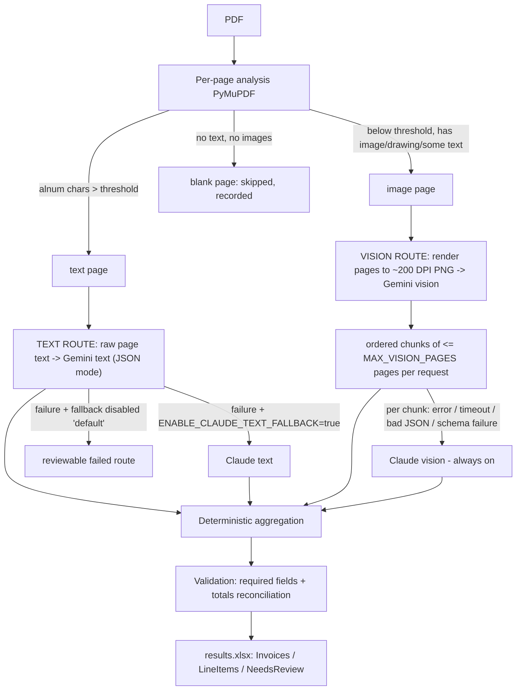

# Invoice Extractor (PoC)

Batch-extracts structured data from invoice PDFs — any vendor, any layout, no
per-vendor templates — and writes an Excel workbook with full extraction
provenance.

> **Scope**: single-user CLI PoC. No web UI, auth, or multi-tenancy (explicit
> later phase). **Assumes one invoice per PDF** — likely multi-invoice files
> are detected and flagged for review, not segmented.

## Architecture and routing

Every page is classified independently; a mixed PDF uses text extraction for
some pages and vision for others — the file is never forced down one route.



If **all** routes fail for a file, a null row is still emitted with
`needs_review=true` — one bad file never stops the batch.

### Vision page chunking

`MAX_VISION_PAGES` (default 5) is the maximum pages **per vision request**,
not per document — **no meaningful page is ever silently dropped**. A document
with more image pages than the limit is split into ordered chunks (e.g. 7
image pages at the default → chunks of 5 + 2). Every chunk is processed:

- each chunk independently gets Gemini-first with Claude-vision fallback;
- original page numbers and ordering are preserved through aggregation;
- if one chunk fails **both** providers, later chunks still run, results from
  successful chunks are retained, the invoice is flagged `needs_review`, and
  the failed page range is named in `review_reason` and `failed_pages`;
- each chunk's pages, provider, model, attempt count, duration, and status
  are recorded in the (sanitized) log.

### Provenance columns (Invoices + NeedsReview sheets)

| Column | Values |
|---|---|
| `document_classification` | `text-native` \| `image-only` \| `mixed` \| `error` |
| `extraction_method` | `text` \| `vision` \| `mixed` \| `failed` |
| `provider` | `gemini` \| `claude` \| `mixed` \| `none` |
| `model` | actual configured model id(s), `+`-joined for mixed routes |
| `text_pages` / `image_pages` / `blank_pages` | contributing page numbers |
| `failed_pages` | pages whose route/chunk failed both providers (if any) |
| `vision_chunk_count` | vision requests attempted for the document |

Page columns use a stable human-readable range format — `1-2,5-7` — never
Python list syntax.

A Claude text fallback result is therefore always distinguishable from a
Gemini text result (`provider=claude`, `model=<CLAUDE_TEXT_MODEL>`).
`provider=mixed` means the two routes were served by different providers —
the per-route breakdown is in `run.log`.

### Aggregation rules (mixed/multi-route PDFs)

1. Routes are ordered by first contributing page; line items concatenate in
   that order (within-route order is document order), preserving page order.
2. Duplicate line items are dropped only on strong evidence: all four fields
   non-null and exactly equal to an already-merged item. Repeated table
   headers are excluded at the prompt level.
3. Header fields prefer non-null values. Conflicting non-null values are
   **never merged silently**: monetary fields keep the value from the route
   containing the last meaningful page (document totals normally sit at the
   end); other fields keep the first route's value — and the invoice is
   flagged `needs_review` with both values either way.
4. A conflicting `invoice_number` is flagged as a likely multi-invoice PDF —
   split the file and re-run.

### Validation rules

Passing **any** of these makes the arithmetic consistent
(tolerance = `max(TOTAL_ABS_TOLERANCE, TOTAL_REL_TOLERANCE × |total|)`):

1. `sum(line_items.amount) + tax_amount ≈ total_amount` (exclusive tax)
2. `sum(line_items.amount) ≈ total_amount` (inclusive or zero tax)
3. `subtotal + tax_amount ≈ total_amount` **and** `sum(line_items) ≈ subtotal`

Otherwise the arithmetic is flagged **inconclusive** (not "wrong"): the
schema has no discount / shipping / duties / rounding fields, so an
unexplained difference may be a legitimate charge. Missing amounts are never
invented; zero is preserved as `0`, never null. Monetary values are `Decimal`
internally (converted to numeric Excel cells at export only).

## Setup

Requires Python 3.11+.

```bash
python3 -m venv .venv
source .venv/bin/activate          # Windows: .venv\Scripts\activate
pip install -r requirements.txt    # dev/testing: pip install -r requirements-dev.txt
cp .env.example .env               # then add your keys
```

Uses the current **`google-genai`** SDK (migrated from the deprecated
`google-generativeai` package, which Google has end-of-lifed) and the
`anthropic` SDK. Keys come from `.env` / environment only.

`.env.example` is a committed template with placeholder values — it never
contains real keys. `.env` itself is git-ignored: **never commit your real
provider keys.**

### Providers: Gemini and Claude

Provider roles are **fixed by design** — this is not a "pick Claude or
Gemini" setting:

| | Required? | Role |
|---|---|---|
| **Gemini** (`GEMINI_API_KEY`) | **Required** for any real extraction | Primary provider for both the text route and the vision route |
| **Claude** (`ANTHROPIC_API_KEY`) | Optional | Vision-route fallback (used automatically if Gemini vision fails); text-route fallback too, but only if `ENABLE_CLAUDE_TEXT_FALLBACK=true` |

Leave `ANTHROPIC_API_KEY` blank to run Gemini-only — vision extraction still
works, it just has no fallback if Gemini vision fails on a given file (that
file is flagged `needs_review`, the batch still completes).

**Neither key is required** to import the package, run `--help`, run
`classify`/`render` (offline stage tests), or run `doctor` in its default
(non-`--live`) mode — those never call a provider. Run
`python -m invoice_extractor doctor` any time to see exactly which keys are
configured (values are never printed) and what that enables.

### Configuration (environment variables)

| Variable | Default | Purpose |
|---|---|---|
| `GEMINI_API_KEY` / `ANTHROPIC_API_KEY` | — | provider keys (never logged) |
| `GEMINI_TEXT_MODEL` | `gemini-flash-latest` | text-route primary model |
| `GEMINI_VISION_MODEL` | `gemini-flash-latest` | vision-route primary model |
| `CLAUDE_TEXT_MODEL` | `claude-sonnet-5` | text-route fallback model |
| `CLAUDE_VISION_MODEL` | `claude-sonnet-5` | vision-route fallback model |
| `ENABLE_CLAUDE_TEXT_FALLBACK` | `false` | text path stays Gemini-only by default (original cost design); vision fallback is always on |
| `TEXT_QUALITY_THRESHOLD` | `20` | alnum chars/page above which a page is text-native |
| `RENDER_DPI` | `200` | vision rendering resolution |
| `MAX_VISION_PAGES` | `5` | max pages **per vision request** (documents with more image pages are chunked; every page is processed) |
| `MAX_RETRIES` | `3` | total attempts per provider call |
| `REQUEST_TIMEOUT_SECONDS` | `120` | per-request timeout, both providers |
| `TOTAL_ABS_TOLERANCE` / `TOTAL_REL_TOLERANCE` | `0.02` / `0.005` | totals reconciliation |
| `SAVE_DEBUG_ARTIFACTS` / `DEBUG_ARTIFACT_DIR` | `false` / `./output/debug` | see privacy warning |

Model names are logged at startup; defaults are current published aliases but
**only `doctor --live` confirms a model is accepted by the provider**.

## Usage

```bash
# Health check (offline - no provider calls)
python -m invoice_extractor doctor

# Stage tests (offline - no tokens spent)
python -m invoice_extractor classify --input ./samples   # per-page routing report
python -m invoice_extractor render   --input ./samples   # PNGs vision would see

# Full pipeline
python -m invoice_extractor run --input ./samples --output ./output/results.xlsx

# Smoke script (same pipeline + printed summary)
python test_pipeline.py
```

### First successful run

1. Drop a few invoice PDFs into `samples/` (two generated fixtures — one
   text-native, one scanned-image — are already there so you can try this
   immediately; delete them once you have real samples. See
   [samples/README.md](samples/README.md)).
2. Preview routing at no cost: `python -m invoice_extractor classify --input ./samples`
   shows which pages will go to the text route vs the vision route, before
   any tokens are spent.
3. Run the full pipeline:
   ```bash
   python -m invoice_extractor run --input ./samples --output ./output/results.xlsx
   ```
4. Open `output/results.xlsx` and check all three sheets:
   - **Invoices** — one row per file: header fields plus extraction
     provenance (`document_classification`, `extraction_method`, `provider`,
     `model`, page ranges, `needs_review`, `review_reason`).
   - **LineItems** — every extracted line item, tied back to its invoice via
     `invoice_id`.
   - **NeedsReview** — only the rows worth a human look: file name, invoice
     number, a human-readable `review_reason`, and — when the flag traces to
     specific line rows (e.g. a suspicious hallucinated row) —
     `line_numbers`/`line_descriptions` pointing at exactly which lines to
     check.
5. Exit code `0` means the batch *completed*, not that every invoice is
   clean — always check `NeedsReview` after a run.

### Review outcomes vs program failure (exit codes)

**Invoice-level review is not a CLI failure.** An invoice flagged
`needs_review=true` — including every invoice failing because API keys are
missing — is an *expected, reviewable data outcome*: the batch still
completes and the workbook and log are still written. Both `run` (the real
CLI entrypoint) and the parallel root-level smoke script (`test_pipeline.py`)
share this policy and exit **0** in that case.

`run` prints a summary after every completed batch: files processed,
invoices extracted (successful structured extractions), line items
extracted, needs-review count, failed/problem count, a breakdown by
extraction method, and the workbook output path. `test_pipeline.py`'s
summary is the same idea with two additional counts (PDFs discovered vs
processed, kept separate for the smoke-script's own diagnostics).

Both exit nonzero only for **fatal tool-level failures** — a bad extraction
on one invoice never counts as one of these, it only ever raises the
needs-review/failed counts in the summary above:

| Exit | Condition |
|---|---|
| `0` | batch completed and outputs written (even if every row needs review); or no PDFs found |
| `2` | input path cannot be accessed |
| `1` | config could not be loaded, the log/output location could not be created, the workbook could not be written, or an uncaught orchestration failure prevented batch completion |

Neither command ever prints API keys, provider config, or raw LLM
prompts/responses in its summary — only counts, filenames, and the output
path (see [Privacy and data protection](#privacy-and-data-protection)).

## Testing

### Offline test suite (no keys, no network)

```bash
pip install -r requirements-dev.txt
pytest
```

145 tests cover classification thresholds, unicode, blank/mixed/corrupt PDFs,
mocked provider success/failure/fallback paths, vision-page chunking, retry
policy, numeric parsing, aggregation conflicts, validation tolerances, Excel
integrity, and the smoke-script exit-code policy. A network-blocking fixture
makes any accidentally unmocked API call fail immediately; retries never
sleep for real.

### Controlled live smoke test (requires keys; costs a few tokens)

```bash
python -m invoice_extractor doctor --live
```

Sends the smallest practical request per configured route (Gemini text,
Gemini vision, Claude text, Claude vision — a "reply OK" prompt and a tiny
generated blank PNG, **never an invoice**) to confirm the provider accepts
each model id. Probe failures are classified (missing key / authentication
failure / model not found / rate limited / timeout / network failure) and
are never retried. Run this before the first real batch. Only after
`doctor --live` passes, drop **non-confidential sample** invoices into
`samples/` and run the pipeline.

## Privacy and data protection

- Invoice PDFs are confidential business data. `samples/*.pdf`, `output/`,
  and `.env` are git-ignored — never commit them.
- Normal logs (`output/run.log`) contain run id, filenames, page numbers,
  classifications, provider/model names, attempt counts, durations, and
  sanitized (truncated, key-redacted) error summaries — **never** API keys,
  raw provider responses, extracted invoice text, or image data.
- `SAVE_DEBUG_ARTIFACTS=true` persists raw provider responses (i.e. full
  invoice contents) to `DEBUG_ARTIFACT_DIR`. Disabled by default; enable only
  while actively debugging and treat the directory as confidential.
- Invoice contents ARE sent to Google and Anthropic APIs when you run the
  pipeline — that is the product working as designed. Review both providers'
  data-handling terms before processing real invoices.

## Troubleshooting

| Symptom | Cause / fix |
|---|---|
| `GEMINI_API_KEY is not set` in review_reason | No `.env` or key missing. `cp .env.example .env`, add keys, re-run `doctor`. |
| `doctor --live` fails with `NotFoundError` / 404 | Model id not accepted by the provider. Set `*_MODEL` vars to a current id; check provider docs. |
| Frequent `transient RateLimitError, retrying` in log | Provider rate limits. Lower batch size, raise `MAX_RETRIES`, or wait. Backoff is automatic (1→2→4s… capped 30s). |
| `APITimeoutError` / `ReadTimeout` | Slow provider or large scans. Raise `REQUEST_TIMEOUT_SECONDS`; lower `RENDER_DPI` or `MAX_VISION_PAGES`. |
| `malformed JSON in response` then Claude fallback | Normal self-healing on the vision route. If the text route hits it with fallback disabled, the row is flagged for review — consider `ENABLE_CLAUDE_TEXT_FALLBACK=true`. |
| `unreadable PDF` | Corrupt/encrypted file. The row is flagged; the batch continues. Re-export the PDF. |
| Row with `totals inconclusive` | Arithmetic doesn't reconcile — often discount/shipping/duties the schema doesn't model. Review manually; tune `TOTAL_*_TOLERANCE` for rounding-heavy vendors. |
| `conflict in <field>` / `possible multiple invoices` | Pages disagree. Verify the PDF holds a single invoice; split multi-invoice files. |
